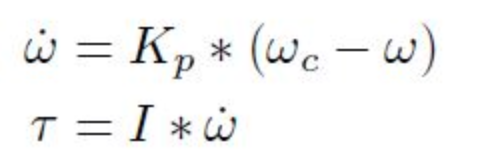
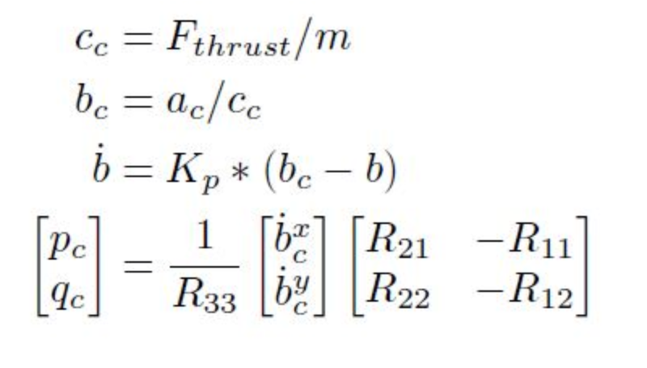
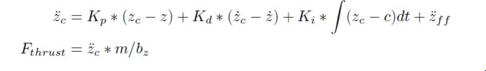

# Controls
### Intro (scenario 1) ###

Adjusted the mass of drone in `QuadControlParams.txt` Mass = 0.5.

### Body rate and roll/pitch control (scenario 2) ###

#### 1. implement the code in the function `GenerateMotorCommands()` ####

In this code convert a desired 3-axis moment and collective thrust command to individual motor thrust commands.
f1, f2, f3, f4 are individual motors thrust, located front left, front right, rear left and rear right.
kappa is drag / thrust ratio and l is drone arm length.
total thrust = f1 + f2 + f3 + f4
Roll is produced by 1st and 3rd propellers - 2nd and 4th propellers.
tau_x = (f1 + f3 - f2 - f4 ) / l
Pitch is produced by 1st and 2nd propellers - 3rd and 4th propellers.
tau_y = (f1 + f2 - f3- f4) / l
Yaw is produced by clockwise counterclockwise propeller difference.
tau_z = -1 * (f1 - f2 + f4 - f3) * k

#### 2. implement the code in the function `BodyRateControl()`####

Implemented P controller to calculate a desired 3-axis moment given a desired and current body rate.

#### 3. Tune `kpPQR` in `QuadControlParams.txt` to get the vehicle to stop spinning quickly but not overshoot ####

Adjust the kpPQR parameter to stop drone flipping.

#### 4. Implement roll / pitch control ####

Implemented P controller to calculate a desired pitch and roll angle rates based on a desired global lateral acceleration, the current attitude of the quad, and desired collective thrust command

#### 5. Tune `kpBank` in `QuadControlParams.txt` to minimize settling time but avoid too much overshoot ####

Adjust the kpBank param to quad level itself, though it’ll still be flying away slowly since we’re not controlling velocity/position

Math :-

Where omega_dot is the angular acceleration round x-axis, y-axis and z-axis in body
frame. omega_c is the commanded angular velocity in body frame, while omega is the
actual angular velocity in body frame. Kp is the control gain parameter. I is
the moment of inertia, and finally tau is the resulting moment. All variables are
vectors unless explicitly stated otherwise.

#### 3. `Roll Pitch Control`
Please refer to function QuadControl::RollPitchControl in L124 – L172 in QuadControl.cpp. Math behind the scene is:

Where Fthrust is the total thrust and m is the mass of the drone (scalar). a_c is the commanded acceleration. Kp is the control gain parameter. R is the rotation matrix w.r.t. the current attitude of the drone, and b is the last column vector of R (that is, bx = R13, by = R23, bz = R33). pc and qc are the commanded body rate around x-axis and y-axis (scalars), which will be fed to body rate control.

#### 4. `Altitude Control`
Please refer to function QuadControl::AltitudeControl in L174 – L220 in QuadControl.cpp. Math behind the scene is:

Where z_dot_dot_c is the commanded acceleration along the z-axis in inertial frame, z_c, z, z_dot_c and z_dot is the commanded/actual altitude and commanded/actual velocity along the z axis in inertial frame. z_dot_dot_ff is the feed-forward acceleration and Kp, Kd, Ki are the control gain parameters. All variables in above equations are scalars.

#### 5. `Lateral Position Control`
Please refer to function QuadControl::LateralPositionControl in L223 – L282 in QuadControl.cpp. Math behind the scene is:

Quite similar with altitude control,x_dot_dot_c is the commanded acceleration along the x-axis and y-axis in inertial frame, p_c, p, p_dot_c and p_dot is the commanded/actual horizonal position and commanded/actual horitonzal velocity in inertial frame. p_dot_dot_ff is the feed-forward acceleration and Kp, Kd are the control gain parameters. Necessary clipping is performed to meet the quad dynamics.

#### 6. `Yaw Control`
Please refer to function QuadControl::YawControl in L285 – L322 in QuadControl.cpp. Math behind the scene is:

Where omega_r is the angular velocity around the z-axis in body frame. It is the same as angular velocity of yaw angle (psi_dot) in inertial frame.  psi_c and psi is the commanded yaw angle and actual yaw angle of the drone. Kp is the control gain parameter. All variables above are scalars.
An optimization is done for performing omega_r control. That is, turning in the opposite direction when |omega_r| > pi. Omega_r = psi_dot  holds because with Euler angles in Yaw-Pitch-Roll order, rotation about yaw is applied last. It is not affected by roll and/or pitch rotation so can be considered separately.
